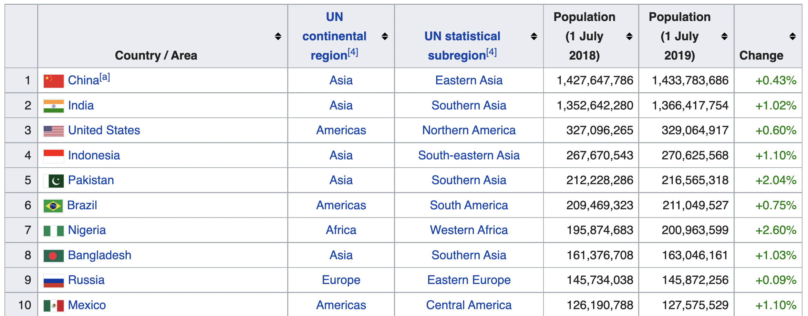

# Read Table

Extract tables from an HTML page.

## Example

This is our table:



Source: https://en.wikipedia.org/wiki/List_of_countries_by_population_(United_Nations)

```python
from pprint import pprint

import requests

from read_table import read_table, to_dict

url = "https://en.wikipedia.org/wiki/List_of_countries_by_population_(United_Nations)"

tables = read_table(requests.get(url).text, attrs={"class": "wikitable"})

table = tables[0]

# As a list of lists

pprint(table)

"""
[
    [
        "Country / Area",
        "UN continental region [4]",
        "UN statistical subregion [4]",
        "Population (1 July 2018)",
        "Population (1 July 2019)",
        "Change",
    ],
    ["China [a]", "Asia", "Eastern Asia", "1,427,647,786", "1,433,783,686", "+0.43%"],
    ["India", "Asia", "Southern Asia", "1,352,642,280", "1,366,417,754", "+1.02%"],
    [
        "United States",
        "Americas",
        "Northern America",
        "327,096,265",
        "329,064,917",
        "+0.60%",
    ],
    ...
]
"""

# As a list of dicts

pprint(to_dict(table))

"""
[
    {
        "Change": "+0.43%",
        "Country / Area": "China [a]",
        "Population (1 July 2018)": "1,427,647,786",
        "Population (1 July 2019)": "1,433,783,686",
        "UN continental region [4]": "Asia",
        "UN statistical subregion [4]": "Eastern Asia",
    },
    {
        "Change": "+1.02%",
        "Country / Area": "India",
        "Population (1 July 2018)": "1,352,642,280",
        "Population (1 July 2019)": "1,366,417,754",
        "UN continental region [4]": "Asia",
        "UN statistical subregion [4]": "Southern Asia",
    },
    {
        "Change": "+0.60%",
        "Country / Area": "United States",
        "Population (1 July 2018)": "327,096,265",
        "Population (1 July 2019)": "329,064,917",
        "UN continental region [4]": "Americas",
        "UN statistical subregion [4]": "Northern America",
    },
    ...
]
"""
```
